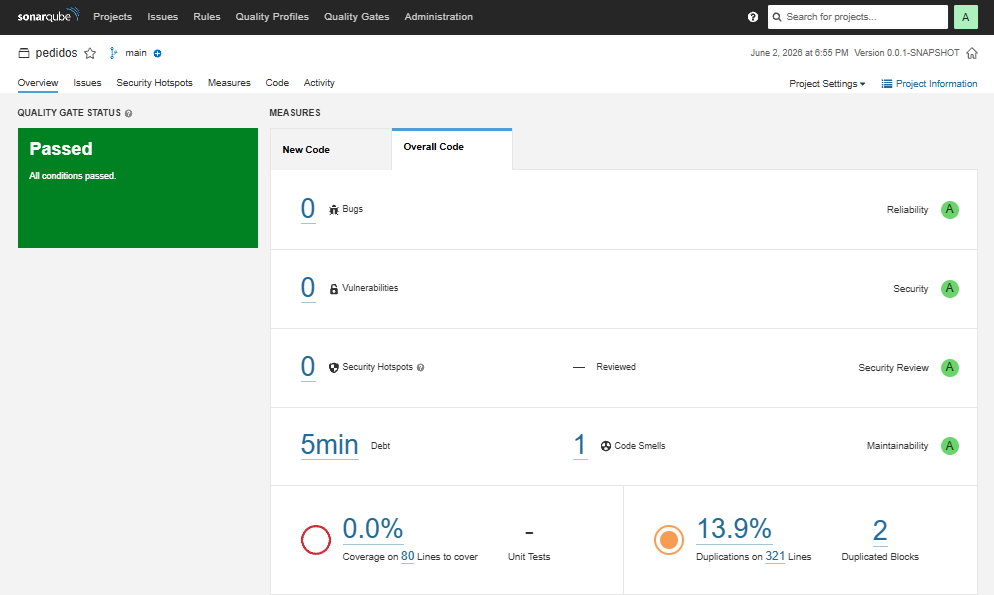
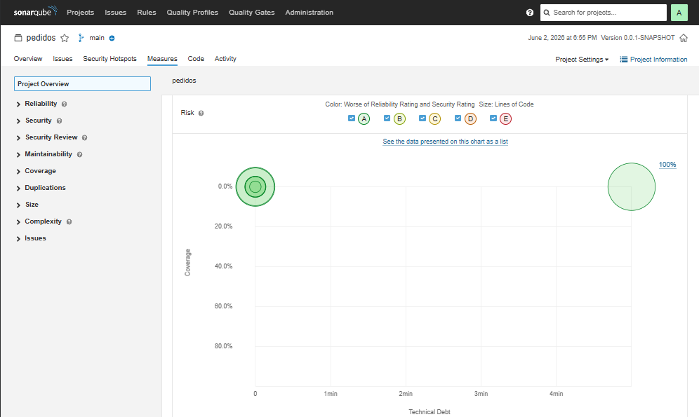
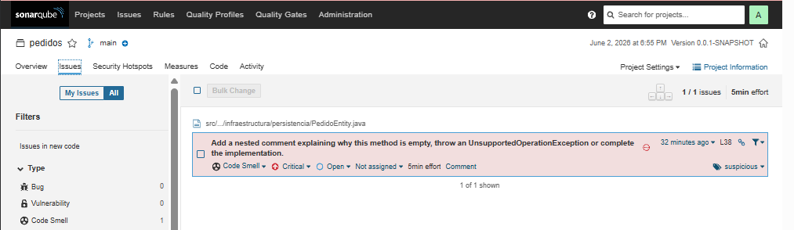
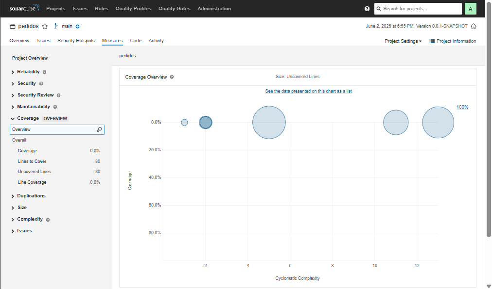
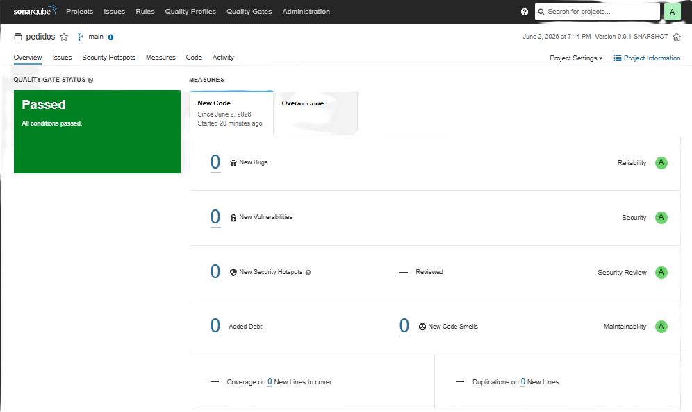
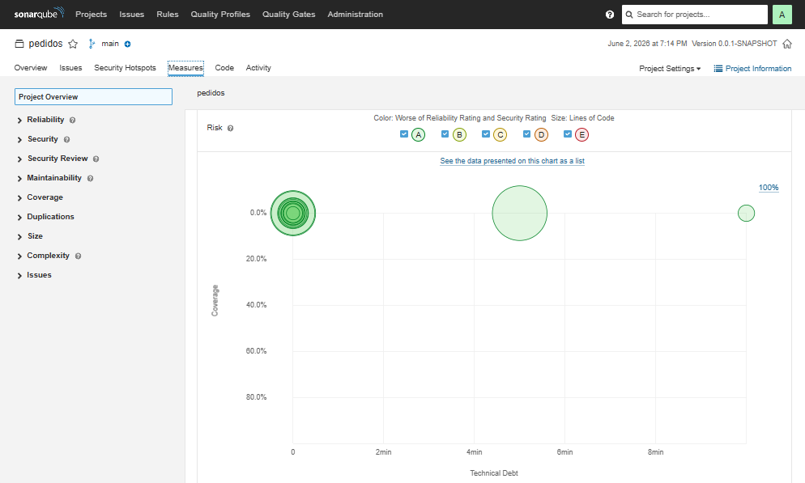
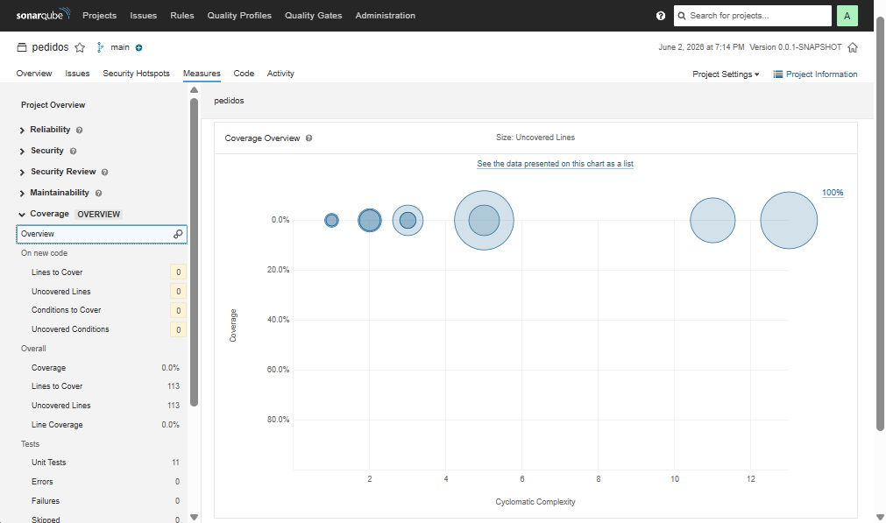

# Sistema de Gestión de Pedidos

Sistema Spring Boot para modelar la gestión de pedidos con una arquitectura por capas y cuatro patrones integrados: Strategy, Factory, Observer y Facade.

## Arquitectura del sistema

La solución está organizada con enfoque feature-first y dependencia hacia adentro:

```text
src/main/java/com/empresa/pedidos/
├── PedidosApplication.java
├── dominio/
│   ├── Pedido.java
│   ├── TipoPedido.java
│   ├── EstadoPedido.java
│   ├── PedidoProcesadoEvent.java
│   └── puertos/
│       ├── RepositorioPedidos.java
│       ├── ProcesadorPedido.java
│       └── ServicioNotificacion.java
├── aplicacion/
│   ├── ServicioPedidos.java
│   └── ProcesadorPedidoFactory.java
├── infraestructura/
│   ├── persistencia/
│   │   ├── PedidoEntity.java
│   │   └── RepositorioPedidosJpa.java
│   └── notificaciones/
│       ├── NotificacionEmail.java
│       └── NotificacionLog.java
└── adaptadores/
    ├── procesadores/
    │   ├── ProcesadorPedidoEstandar.java
    │   ├── ProcesadorPedidoExpress.java
    │   └── ProcesadorPedidoInternacional.java
    ├── facade/
    │   └── FachadaPedidos.java
    └── rest/
        └── PedidoController.java
```

### Flujo de ejecución

1. `PedidoController` recibe la solicitud REST.
2. `FachadaPedidos` expone una interfaz simple al controlador.
3. `ServicioPedidos` orquesta la creación del pedido.
4. `ProcesadorPedidoFactory` selecciona la estrategia correcta.
5. `RepositorioPedidosJpa` persiste el pedido ya procesado.
6. `ApplicationEventPublisher` emite `PedidoProcesadoEvent`.
7. `NotificacionEmail` y `NotificacionLog` reaccionan al evento de forma desacoplada.

## Justificación de los patrones

Cada patrón resuelve un problema distinto, no una variación del mismo problema:

- Strategy: separa algoritmos de cálculo que cambian según el tipo de pedido.
- Factory: centraliza la selección de la estrategia correcta sin condicionales en la capa de aplicación.
- Observer: desacopla notificaciones y efectos secundarios del flujo principal de procesamiento.
- Facade: simplifica la interfaz pública para que el controlador no conozca detalles internos de orquestación.

## Resultados esperados de SonarQube

La refactorización busca mejorar la mantenibilidad y reducir complejidad en el flujo principal:

| Métrica | Antes | Después |
| --- | --- | --- |
| Cyclomatic Complexity del flujo principal | 4 | 1 |
| Cognitive Complexity del servicio principal | 6 | 0 |
| Dependencia directa a JavaMailSender | Sí | No |
| Dependencia directa a JPA Repository desde aplicación | Sí | No |
| Cobertura objetivo | No definida | Mayor al 80% |

## Evidencias SonarQube

Las capturas están en [capturas](capturas) y se incluyen aquí para documentar el antes y el después del análisis.

### Antes de la refactorización









### Después de la refactorización







## Pruebas

- [ProcesadorPedidosTest](src/test/java/com/empresa/pedidos/adaptadores/procesadores/ProcesadorPedidosTest.java): valida Strategy.
- [ProcesadorPedidoFactoryTest](src/test/java/com/empresa/pedidos/aplicacion/ProcesadorPedidoFactoryTest.java): valida Factory.
- [NotificacionPedidoProcesadoTest](src/test/java/com/empresa/pedidos/infraestructura/notificaciones/NotificacionPedidoProcesadoTest.java): valida Observer.
- [FachadaPedidosTest](src/test/java/com/empresa/pedidos/adaptadores/facade/FachadaPedidosTest.java): valida Facade.
- [PedidosIntegrationTest](src/test/java/com/empresa/pedidos/integracion/PedidosIntegrationTest.java): valida el flujo completo con `@SpringBootTest`.
- [ArquitecturaCapasTest](src/test/java/com/empresa/pedidos/arquitectura/ArquitecturaCapasTest.java): valida reglas de dependencias con ArchUnit.

## Validación Arquitectónica

Se definen pruebas ejecutables con ArchUnit para asegurar que la arquitectura se cumple.
Reglas principales implementadas en `src/test/java/com/empresa/pedidos/ReglasArquitectura.java`:

- **Dominio aislado**: las clases en `..dominio..` no deben depender de `..infraestructura..`, `..adaptadores..`, `javax.persistence..` ni `org.springframework.mail..`.
- **Controladores sólo acceden a la Facade**: las clases en `..adaptadores.rest..` solo pueden acceder a `..adaptadores.facade..`, `..dominio..`, `org.springframework.web..` y `java..`.
- **Puertos como interfaces**: las clases en `..dominio.puertos..` deben ser interfaces.
- **Procesadores implementan el puerto**: las clases en `..adaptadores.procesadores..` deben implementar `ProcesadorPedido`.
- **Infraestructura no accede a REST**: las clases en `..infraestructura..` no deben acceder a `..adaptadores.rest..`.

Ejecutar las pruebas de arquitectura:

```bash
mvn test -Dtest=ReglasArquitectura
```

Salida esperada (sin violaciones):

```
Tests run: 5, Failures: 0, Errors: 0, Skipped: 0
```

Si se detecta una violación, ArchUnit imprime el detalle indicando qué clase y método incumplen la regla. El workflow de GitHub Actions (`.github/workflows/arquitectura.yml`) ejecuta estas pruebas en cada push a `main` y `develop`.

## Ejecución local

Compila y prueba con:

```bash
mvn clean package
```

```bash
mvn test
```

Ejecuta SonarQube con:

```bash
mvn clean verify sonar:sonar -Dsonar.projectKey=pedidos-integrado -Dsonar.host.url=http://localhost:9000 -Dsonar.login=<token>
```

## Estructura de evidencias

La carpeta [capturas](capturas) contiene las imágenes PNG del análisis de SonarQube.
